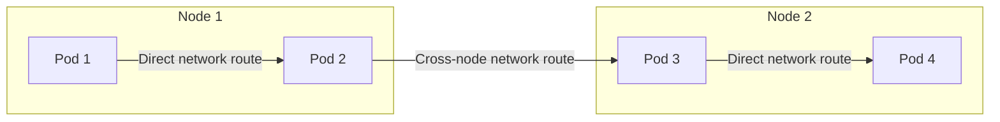
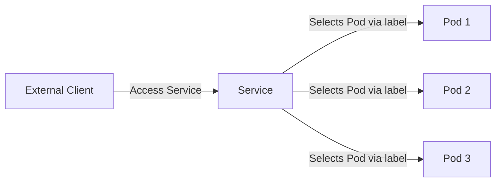
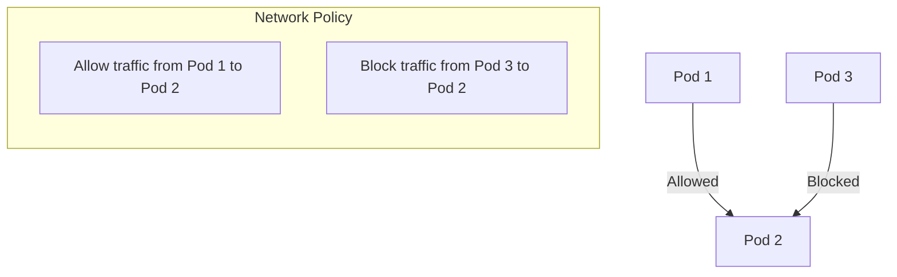

### Architecture
In Kubernetes, the architecture is divided mainly into two types of nodes: Master nodes and Worker nodes. Let's delve into what each of these entails:

### Master Nodes
Master nodes are responsible for managing the state of the Kubernetes cluster. They make global decisions about the cluster (like scheduling), as well as detecting and responding to cluster events (like starting up a new pod when a deployment's replicas field is unsatisfied).

Key Components of Master Nodes:
1. **API Server (kube-apiserver):** This is the front end of the Kubernetes control plane and acts as a gateway to the Kubernetes API. It processes REST requests, validates them, and executes the contained business logic.

2. **Etcd:** A consistent and highly-available key-value store used as Kubernetes' backing store for all cluster data.

3. **Scheduler (kube-scheduler):** It watches for newly created pods with no assigned node, and selects a node for them to run on based on various factors like resources, constraints, affinity specifications, data locality, etc.

4. **Controller Manager (kube-controller-manager):** This component runs controller processes like Node Controller, Job Controller, Endpoints Controller, etc. It's responsible for noticing and responding when nodes go down, creating endpoints, and so on.

5. **Cloud Controller Manager (cloud-controller-manager):** This optional component lets you link your cluster into your cloud provider's API, allowing the cluster to interface with the underlying infrastructure of the cloud service.

### Worker Nodes
Worker nodes are the machines where your actual workloads (like applications and services) run. They are managed by the master nodes and contain the necessary services to run pods, managed by the Kubernetes master.

Key Components of Worker Nodes:
1. **Kubelet:** An agent that runs on each node in the cluster. It makes sure that containers are running in a Pod.

2. **Kube-Proxy:** This maintains network rules on nodes. These network rules allow network communication to your Pods from network sessions inside or outside of your cluster.

3. **Container Runtime:** The software responsible for running containers. Kubernetes supports several runtimes like Docker, containerd, CRI-O, etc.

4. **Pods:** The smallest deployable units of computing that can be created and managed in Kubernetes. A Pod encapsulates an application’s container (or, in some cases, multiple containers), storage resources, a unique network IP, and options that govern how the container(s) should run.

### Communication Flow:
- **Control Plane to Node Communication:** The control plane (master) communicates with individual nodes (workers) via the Kubernetes API server. Nodes communicate with the API server to get instructions and report back their status.

- **Node to Control Plane Communication:** Nodes communicate with the control plane for services like kubelet, kube-proxy, and container runtime.

### Key Points:
- The master node manages the cluster and typically runs no user applications.
- Worker nodes run the applications and workloads.
- High availability can be achieved by running multiple master nodes.
- Kubernetes abstracts the complexity of managing individual servers to a simple and robust API interface.

This architecture allows Kubernetes to efficiently manage the scaling and deployment of applications across a cluster of machines while ensuring high availability and redundancy.

--------------

In a Kubernetes cluster, several critical components work together to manage the state and operation of the cluster. The key components include the API Server, Scheduler, Controller Manager, and etcd. Let's break down the role of each:

### 1. API Server (kube-apiserver)
- **Role**: It acts as the central management entity and the only component that directly interacts with the Kubernetes cluster.
- **Functions**:
  - **Front-End to the Control Plane**: The API server exposes the Kubernetes API, serving as the front-end for users, management tools, and other components.
  - **Data Validation and Processing**: It validates and processes RESTful requests (like creating Pods, Services, etc.) and updates the corresponding objects in etcd.
  - **Authentication and Authorization**: It authenticates and authorizes requests before processing them.
  - **Data Store Interface**: It acts as a gateway to the data store (etcd), ensuring data integrity and consistency.

### 2. Scheduler (kube-scheduler)
- **Role**: Responsible for assigning new Pods to nodes.
- **Functions**:
  - **Pod Scheduling**: Observes newly created Pods that have no node assigned and selects a node for them based on multiple factors (like resource requirements, data locality, affinity/anti-affinity specifications, etc.).
  - **Load Balancing**: Ensures optimal load distribution across the nodes in the cluster.
  - **Resource Utilization**: Takes into account the current resource usage and capacity of each node to avoid overloading a single node.

### 3. Controller Manager (kube-controller-manager)
- **Role**: Manages various controllers that regulate the state of the cluster, ensuring the cluster's desired state matches its current state.
- **Functions**:
  - **Node Controller**: Monitors nodes and responds if any nodes go down.
  - **Replication Controller**: Ensures the correct number of pods for every replication controller object in the system.
  - **Endpoints Controller**: Populates the Endpoints object (joining Services & Pods).
  - **Service Account & Token Controllers**: Create default accounts and API access tokens for new namespaces.

### 4. etcd
- **Role**: Serves as the primary data store for the cluster, storing and managing the entire state of the Kubernetes cluster.
- **Functions**:
  - **Data Storage**: Stores configuration data, state, and metadata of the cluster.
  - **Highly Available and Consistent**: Ensures data is stored reliably and consistently across cluster restarts or failures.
  - **Key-Value Store**: Uses a key-value structure to store data, allowing for efficient retrieval and storage.

### Interaction and Workflow
- **Data Flow**: The API Server reads and writes to etcd, and all other components interact with the cluster through the API server.
- **Decision Making**: The scheduler and controller manager make decisions based on the cluster's state in etcd and then use the API server to implement these decisions.
- **Control Loop**: Controllers continuously monitor the state of their respective resources and make changes to move the current state towards the desired state.

### Key Points
- The API server is the central interface for all cluster operations.
- The Scheduler assigns nodes to new Pods.
- The Controller Manager runs controllers that handle routine tasks.
- etcd is a reliable, consistent datastore that holds the entire state of the Kubernetes cluster.

These components work in concert to manage the cluster’s lifecycle and operations, ensuring high availability, scalability, and efficient management of containerized applications.

-----------

Setting up a Kubernetes environment involves several key steps. You can either set up a Kubernetes cluster on your local machine for development purposes or on a cloud platform for production.

### Local Development Setup

**Minikube and kubectl**
Minikube is a tool that lets you run Kubernetes locally. It runs a single-node Kubernetes cluster inside a VM on your laptop.

1. **Install Minikube**
   - For installation instructions, visit the [Minikube GitHub page](https://github.com/kubernetes/minikube).
   - Ensure your system meets the prerequisites, such as VT-x/AMD-v virtualization and a Hypervisor (like VirtualBox or Hyper-V).

2. **Install kubectl**
   - `kubectl` is the Kubernetes command-line tool that allows you to run commands against Kubernetes clusters.
   - Follow the instructions on the [Kubernetes official website](https://kubernetes.io/docs/tasks/tools/install-kubectl/) to install it.

3. **Start Minikube**
   - Once installed, start Minikube with `minikube start`.

4. **Verify Installation**
   - Run `kubectl get nodes`. You should see your Minikube node.

### Cloud-Based Kubernetes Setup

Cloud providers like AWS, Google Cloud, and Azure offer managed Kubernetes services (EKS, GKE, AKS). Here's a general guide:

1. **Choose a Cloud Provider**
   - Sign up for an account with a cloud provider that offers a managed Kubernetes service.

2. **Create a Kubernetes Cluster**
   - Follow the provider's documentation to create a Kubernetes cluster. This typically involves specifying the number and type of nodes.

3. **Set Up `kubectl` to Connect to Your Cluster**
   - Once your cluster is ready, configure `kubectl` to connect to your cloud Kubernetes cluster. Cloud providers usually offer a command or a configuration file to set this up.

4. **Verify the Cluster**
   - Run `kubectl get nodes` to see the nodes in your cluster.

### Deploying Your First Application

After setting up your environment, you can deploy an application:

1. **Create a Deployment Configuration**
   - Write a YAML file defining your application's deployment. It should specify the container image, the number of replicas, and other configurations.

2. **Deploy the Application**
   - Use `kubectl apply -f <your-deployment-file.yaml>` to create the deployment.

3. **Expose the Application**
   - If your application has a web interface, expose it using `kubectl expose deployment <deployment-name> --type=LoadBalancer --port=8080`.
   - This command will make your application accessible through a load balancer.

4. **Access the Application**
   - On a cloud provider, the `kubectl expose` command will provide an external IP to access your application.
   - On Minikube, use `minikube service <service-name>` to access the application.

### Monitoring and Management

- **Dashboard**: For local setups, Minikube offers a web-based Kubernetes Dashboard for monitoring. Use `minikube dashboard` to access it.
- **Cloud Tools**: Cloud providers offer their own monitoring and management tools, like AWS CloudWatch, Google Cloud Operations suite, and Azure Monitor.

### Next Steps

- **Learn Kubernetes Concepts**: Familiarize yourself with key Kubernetes concepts like Pods, Deployments, Services, and Ingress.
- **Practice**: Deploy different types of applications, experiment with scaling, and try out rolling updates.
- **Explore Advanced Features**: Look into Helm for package management, set up CI/CD pipelines, and explore advanced networking and storage options.

Setting up and managing a Kubernetes environment can be complex, but it offers great flexibility and scalability for containerized applications. The community and documentation are extensive, so leverage these resources as you explore Kubernetes further.


-----------------
### Installing Minikube for setting up a local Kubernetes environment. 

Minikube is a great tool for learning and testing Kubernetes locally. Here are the steps to install and start using Minikube:

### Prerequisites
1. **Virtualization Support**: Ensure your machine supports hardware virtualization. You can check this in your system's BIOS settings or by looking for "Virtualization Technology (VTx)" in your CPU specifications.
2. **Hypervisor**: Install a hypervisor for your OS:
   - Windows: Hyper-V or VirtualBox.
   - macOS: HyperKit, VMware Fusion, or VirtualBox.
   - Linux: KVM or VirtualBox.

### Step 1: Install kubectl
`kubectl` is the command-line tool for interacting with the Kubernetes cluster.

1. **Download kubectl**:
   - You can download it from the [Kubernetes release page](https://kubernetes.io/docs/tasks/tools/install-kubectl/).

2. **Install kubectl**:
   - Follow the instructions specific to your operating system.

### Step 2: Install Minikube
Minikube runs a single-node Kubernetes cluster inside a VM on your laptop.

1. **Download Minikube**:
   - Visit the [Minikube releases page](https://github.com/kubernetes/minikube/releases) to download the latest release.

2. **Install Minikube**:
   - On Windows, you can use an installer or install it via direct download.
   - On macOS and Linux, you generally download the executable and add it to your PATH.

3. **Verify Installation**:
   - Run `minikube version` to ensure it's installed correctly.

### Step 3: Start Minikube
1. **Launch Minikube**:
   - Run the command `minikube start`. This will start a Kubernetes cluster using your chosen hypervisor.
   - The first time you run this, Minikube will download necessary Kubernetes components, which might take some time.

2. **Configure Minikube** (Optional):
   - You can specify the VM driver (hypervisor) with `minikube start --driver=<driver_name>`.
   - You can adjust memory, CPUs, and disk space using flags like `--memory`, `--cpus`, and `--disk-size`.

### Step 4: Verify the Cluster
- **Check Cluster Status**:
  - Run `minikube status` to check the status of the Minikube VM and the Kubernetes cluster.
- **Get Nodes**:
  - Run `kubectl get nodes` to see the nodes in your Minikube cluster.

### Step 5: Accessing Kubernetes Dashboard
- Minikube comes with a built-in dashboard for Kubernetes.
- Run `minikube dashboard` to open it in your default web browser.

### Step 6: Deploying a Sample Application
- To deploy a sample application, you can use `kubectl create deployment`.
- For example, `kubectl create deployment hello-minikube --image=k8s.gcr.io/echoserver:1.10` creates a simple echo server deployment.
- You can expose this deployment using `kubectl expose`.

### Step 7: Stop and Delete the Minikube Cluster
- When finished, you can stop the Minikube VM with `minikube stop`.
- To delete the Minikube cluster and clean up, use `minikube delete`.

### Additional Tips
- **Updating Minikube**: Keep Minikube updated to the latest version for new features and security fixes.
- **Learning Resources**: Utilize the Kubernetes documentation and community resources to learn more about deploying and managing applications on Kubernetes.

Remember, Minikube is for testing and development purposes and is not suited for a production environment. For production, consider a managed Kubernetes service offered by cloud providers.

------------
### Ubuntu based installation

Here are the step-by-step instructions to install `kubectl` and `Minikube` on an Ubuntu system.

### Installing kubectl on Ubuntu

1. **Update the Package Index**:
   Open a terminal and run:
   ```bash
   sudo apt-get update
   ```

2. **Install curl** (if not already installed):
   ```bash
   sudo apt-get install -y curl
   ```

3. **Download the Latest Release of kubectl**:
   ```bash
   curl -LO "https://dl.k8s.io/release/$(curl -L -s https://dl.k8s.io/release/stable.txt)/bin/linux/amd64/kubectl"
   ```

4. **Make the kubectl Binary Executable**:
   ```bash
   chmod +x ./kubectl
   ```

5. **Move the Binary into Your PATH**:
   ```bash
   sudo mv ./kubectl /usr/local/bin/kubectl
   ```

6. **Test to Ensure the Version You Installed is Up-to-Date**:
   ```bash
   kubectl version --client
   ```

### Installing Minikube on Ubuntu

1. **Check if Virtualization is Supported**:
   Run the following command to check if your CPU supports virtualization. Look for `vmx` (for Intel CPUs) or `svm` (for AMD CPUs) in the output.
   ```bash
   grep -E --color 'vmx|svm' /proc/cpuinfo
   ```

2. **Install a Hypervisor**:
   You can use VirtualBox as the hypervisor for Minikube.

   Install VirtualBox:
   ```bash
   sudo apt install -y virtualbox virtualbox-ext-pack
   ```

3. **Download Minikube**:
   ```bash
   curl -Lo minikube https://storage.googleapis.com/minikube/releases/latest/minikube-linux-amd64
   ```

4. **Make Minikube Executable**:
   ```bash
   chmod +x minikube
   ```

5. **Add Minikube to Your PATH**:
   ```bash
   sudo mv minikube /usr/local/bin/
   ```

6. **Start Minikube**:
   Once installed, start Minikube using:
   ```bash
   minikube start
   ```

7. **Verify Minikube is Running**:
   Check the status of Minikube with:
   ```bash
   minikube status
   ```

### Additional Notes
- **kubectl**: It's important to use a `kubectl` version that is within one minor version difference of your Minikube's Kubernetes version. 
- **Minikube Drivers**: Minikube supports various drivers (VirtualBox, KVM2, Docker, etc.). If you prefer a different driver than VirtualBox, install that driver and specify it when starting Minikube with `minikube start --driver=<driver_name>`.
- **Resource Allocation**: You can customize the resources allocated to Minikube (like CPU, memory) using flags in the `minikube start` command.
- **Connectivity**: Ensure your Ubuntu firewall and router settings allow the necessary traffic for Kubernetes.

This setup will give you a local Kubernetes environment on your Ubuntu system, perfect for development and testing purposes.


--------------

### Overview of `kubectl`

**1. What is `kubectl`?**
   - `kubectl` is a command-line interface (CLI) for running commands against Kubernetes clusters.
   - It allows you to deploy applications, inspect and manage cluster resources, and view logs.

**2. Key Features**
   - **Control of Kubernetes Cluster:** Manage various aspects of the cluster.
   - **Deployment and Management of Applications:** Deploy and update applications on Kubernetes.
   - **Debugging and Troubleshooting:** Inspect and diagnose applications and cluster components.

**3. Installation**
   - `kubectl` can be installed on various operating systems (Linux, macOS, Windows).
   - It's typically installed as part of the Kubernetes installation.

**4. Basic Command Structure**
   - `kubectl [command] [type] [name] [flags]`
   - **command:** what operation to perform (e.g., `get`, `create`, `delete`)
   - **type:** the resource type (e.g., `pods`, `services`)
   - **name:** the name of the resource
   - **flags:** optional flags (e.g., `-o wide` for more detailed output)

**5. Common Commands**
   - `kubectl get`: List resources.
   - `kubectl describe`: Show detailed information about a resource.
   - `kubectl create`: Create a resource from a file or stdin.
   - `kubectl apply`: Apply a configuration to a resource.

**6. Working with YAML Files**
   - Kubernetes resources can be created, updated, and deleted by using YAML files.
   - `kubectl` uses these files to apply the desired state to the cluster.

**7. Context and Configuration**
   - `kubectl` uses a configuration file (usually `~/.kube/config`) to find the information it needs to choose a cluster and communicate with it.
   - You can switch between different clusters using contexts.

--------------


### Creating and Managing a Simple Kubernetes Pod

#### 1. Prerequisites
- **Kubernetes Cluster**: Ensure you have a Kubernetes cluster running. You can use minikube for a local setup.
- **Kubectl**: Install kubectl, the command line tool for Kubernetes.

#### 2. Writing a Pod Manifest
- A Pod is the smallest deployable unit in Kubernetes.
- Create a YAML file (e.g., `my-pod.yaml`) for the Pod definition.
- Example Pod Manifest:

  ```yaml
  apiVersion: v1
  kind: Pod
  metadata:
    name: my-pod
    labels:
      app: myapp
  spec:
    containers:
    - name: my-container
      image: nginx
      ports:
      - containerPort: 80
  ```

  This manifest creates a Pod named `my-pod` with a single container running the `nginx` image.

#### 3. Creating the Pod
- Run the following command to create the Pod:
  ```bash
  kubectl apply -f my-pod.yaml
  ```
- This tells Kubernetes to create a Pod as defined in `my-pod.yaml`.

#### 4. Checking Pod Status
- Use the following command to check the status of your Pod:
  ```bash
  kubectl get pods
  ```
- This will list all the Pods running in the default namespace, showing their status.

#### 5. Accessing the Pod
- Since the Pod is running an Nginx server, you can port-forward to access it:
  ```bash
  kubectl port-forward my-pod 8080:80
  ```
- This command forwards your local port 8080 to the Pod’s port 80.
- Now, you can access the Nginx server by visiting `http://localhost:8080` in your browser.

#### 6. Viewing Logs
- To view logs from the container in the Pod:
  ```bash
  kubectl logs my-pod
  ```

#### 7. Deleting the Pod
- When you no longer need the Pod, you can delete it:
  ```bash
  kubectl delete pod my-pod
  ```

#### Additional Tips
- **Labels**: Use labels in the manifest for organizing and selecting subsets of objects.
- **Debugging**: Use `kubectl describe pod my-pod` for detailed information about the Pod's status.
- **Namespaces**: By default, Pods are created in the `default` namespace. You can use namespaces to isolate groups of resources.


------------

### Web Application in Kubernetes

Deploying a basic web application in Kubernetes involves several steps, from creating a Docker image of your application to deploying it on a Kubernetes cluster. Here's a step-by-step guide:

### Prerequisites
- **Docker**: Familiarity with Docker and having Docker installed on your machine.
- **Kubernetes Cluster**: Access to a Kubernetes cluster (you can use Minikube for a local setup).
- **Kubectl**: The Kubernetes command-line tool, kubectl, installed and configured to communicate with your cluster.

### Step 1: Create a Simple Web Application
- Develop a simple web application in the language of your choice. For this tutorial, let's assume a basic Node.js app.
- Here's a simple example of a `server.js` file in Node.js:

  ```javascript
  const express = require('express');
  const app = express();
  const PORT = 3000;

  app.get('/', (req, res) => {
    res.send('Hello, Kubernetes!');
  });

  app.listen(PORT, () => {
    console.log(`Server running on port ${PORT}`);
  });
  ```

- Remember to include a `package.json` file with the necessary dependencies (like `express`).

### Step 2: Containerize the Application
- Create a Dockerfile in the root of your application directory.
- Here's an example Dockerfile for a Node.js app:

  ```Dockerfile
  FROM node:14
  WORKDIR /app
  COPY package.json package.json
  RUN npm install
  COPY . .
  EXPOSE 3000
  CMD ["node", "server.js"]
  ```

- Build the Docker image:

  ```bash
  docker build -t my-web-app .
  ```

- Optionally, push this image to a container registry (like Docker Hub or Google Container Registry).

### Step 3: Create a Kubernetes Deployment
- Create a deployment file `web-app-deployment.yaml`:

  ```yaml
  apiVersion: apps/v1
  kind: Deployment
  metadata:
    name: web-app-deployment
  spec:
    replicas: 2
    selector:
      matchLabels:
        app: web-app
    template:
      metadata:
        labels:
          app: web-app
      spec:
        containers:
        - name: web-app
          image: my-web-app:latest
          ports:
          - containerPort: 3000
  ```

- Deploy the application:

  ```bash
  kubectl apply -f web-app-deployment.yaml
  ```

### Step 4: Expose the Application
- Create a service to expose your application:

  ```yaml
  apiVersion: v1
  kind: Service
  metadata:
    name: web-app-service
  spec:
    selector:
      app: web-app
    ports:
      - protocol: TCP
        port: 80
        targetPort: 3000
    type: LoadBalancer
  ```

- Apply the service:

  ```bash
  kubectl apply -f <service-file.yaml>
  ```

- For Minikube, you can view the service using `minikube service web-app-service`.

### Step 5: Access the Application
- Once the service is up, you can access the application through the provided IP and port.
- For cloud-based Kubernetes clusters, the LoadBalancer type can provide an external IP to access the application.

### Additional Tips
- **Persistent Storage**: For applications requiring persistent storage, consider using Kubernetes Volumes.
- **Configurations**: Use ConfigMaps and Secrets for managing configuration and sensitive data.
- **Monitoring and Logging**: Integrate monitoring and logging solutions for better observability.


--------------------
### Workloads and Controllers

Kubernetes workloads are objects that set deployment rules for your applications. Controllers within Kubernetes ensure that the state of your cluster matches the state described in your workload configurations. Here's an overview of the key workloads and controllers in Kubernetes:

### 1. Pods
- **Basic Unit**: The basic deployable unit in Kubernetes that can contain one or more containers.
- **Usage**: Usually managed by a higher-level controller, not directly created by users.

### 2. Deployments
- **Purpose**: Manage stateless applications.
- **Functionality**: Automates the updating of Pods and ReplicaSets.
- **Usage**: Creates a ReplicaSet to ensure the desired number of pods are always running.
- **Scaling**: Easily scale up or down the number of replicas.

### 3. ReplicaSets
- **Purpose**: Ensure a specified number of pod replicas are running at any given time.
- **Usage**: Rarely used directly, often managed by a Deployment.

### 4. StatefulSets
- **Purpose**: Manage stateful applications.
- **Functionality**: Manages the deployment and scaling of a set of Pods, and provides guarantees about the ordering and uniqueness of these Pods.
- **Usage**: Ideal for applications like databases that require persistent storage, stable network identifiers, and orderly deployment and scaling.

### 5. DaemonSets
- **Purpose**: Ensure all (or some) nodes run a copy of a Pod.
- **Usage**: Commonly used for cluster services like log collectors, monitoring agents, etc.

### 6. Jobs and CronJobs
- **Jobs**: Run one or several Pods to completion.
- **CronJobs**: Schedule job execution at specific times or intervals.

### Creating and Managing Workloads

#### Deployments Example
1. **Create a Deployment Manifest (`deployment.yaml`)**

   ```yaml
   apiVersion: apps/v1
   kind: Deployment
   metadata:
     name: nginx-deployment
   spec:
     replicas: 3
     selector:
       matchLabels:
         app: nginx
     template:
       metadata:
         labels:
           app: nginx
       spec:
         containers:
         - name: nginx
           image: nginx:1.14.2
           ports:
           - containerPort: 80
   ```

2. **Deploy to Cluster**

   ```bash
   kubectl apply -f deployment.yaml
   ```

3. **Verify Deployment**

   ```bash
   kubectl get deployments
   ```

#### Managing Pods with ReplicaSets

1. **Create a ReplicaSet Manifest**

   Similar to Deployment, but with `kind: ReplicaSet`.

2. **Apply and Manage ReplicaSet**

   Use `kubectl` commands to create, inspect, scale, and delete ReplicaSets.

#### Managing State with StatefulSets
1. **Create a StatefulSet Manifest**

   Define pod management policy, volumeClaimTemplates for persistent storage, and unique network identifiers.

2. **Apply and Manage StatefulSet**

   Use `kubectl` to manage the lifecycle of StatefulSet similar to Deployments.

#### Scheduling Jobs and CronJobs
1. **Create a Job or CronJob Manifest**

   Define job specifics, including completions, parallelism (for Jobs), and schedule (for CronJobs).

2. **Apply and Manage Jobs/CronJobs**

   Use `kubectl` to create and monitor job executions.

### Best Practices
- **Use Deployments** for most stateless applications.
- **StatefulSets** are essential for applications requiring stable, unique network identifiers, persistent storage, and ordered, graceful deployment and scaling.
- **Monitor and manage** the health of all workloads.
- **Use labels and selectors** effectively to manage and organize resources.
- **Understand the lifecycle** of each workload for better resource management.


---------------

Understanding Kubernetes Deployments, StatefulSets, and DaemonSets is crucial for effectively managing applications in a Kubernetes cluster. Each of these controllers is used for managing different types of workloads within the cluster.

### Deployments

#### Overview
- **Purpose**: Manage stateless applications.
- **Functionality**: Helps in creating, updating, and scaling stateless applications.
- **Replicas**: Manages multiple replicas of a Pod.

#### Key Features
- **Rolling Updates & Rollbacks**: Safely update and roll back applications.
- **Scalability**: Scale up or down the number of replicas.
- **Self-Healing**: Automatically replaces failed Pods.

#### Creating a Deployment
1. **Define a Deployment YAML file (`deployment.yaml`)**:

   ```yaml
   apiVersion: apps/v1
   kind: Deployment
   metadata:
     name: nginx-deployment
   spec:
     replicas: 3
     selector:
       matchLabels:
         app: nginx
     template:
       metadata:
         labels:
           app: nginx
       spec:
         containers:
         - name: nginx
           image: nginx:1.14.2
           ports:
           - containerPort: 80
   ```

2. **Create the Deployment**:
   ```bash
   kubectl apply -f deployment.yaml
   ```

3. **Inspect the Deployment**:
   ```bash
   kubectl get deployments
   ```

### StatefulSets

#### Overview
- **Purpose**: Manage stateful applications, like databases.
- **Functionality**: Provides stable, unique network identifiers, persistent storage, and ordered, graceful deployment and scaling.

#### Key Features
- **Stable Storage**: Each Pod gets its own persistent volume.
- **Ordered Deployment & Scaling**: Pods are created and terminated in a specific order.
- **Stable Network IDs**: Each Pod maintains a unique, stable network identifier.

#### Creating a StatefulSet
1. **Define a StatefulSet YAML file**:

   ```yaml
   apiVersion: apps/v1
   kind: StatefulSet
   metadata:
     name: web
   spec:
     selector:
       matchLabels:
         app: nginx
     serviceName: "nginx"
     replicas: 3
     template:
       metadata:
         labels:
           app: nginx
       spec:
         containers:
         - name: nginx
           image: nginx
           ports:
           - containerPort: 80
             name: web
   ```

2. **Create the StatefulSet**:
   ```bash
   kubectl apply -f statefulset.yaml
   ```

3. **Inspect the StatefulSet**:
   ```bash
   kubectl get statefulsets
   ```

### DaemonSets

#### Overview
- **Purpose**: Ensure that all (or some) nodes run a copy of a Pod.
- **Functionality**: Used for running a daemon on every node in the cluster.

#### Key Features
- **Node Coverage**: Automatically runs a Pod on new nodes when they are added to the cluster.
- **Cluster Services**: Ideal for cluster-wide services like logging and monitoring agents.

#### Creating a DaemonSet
1. **Define a DaemonSet YAML file**:

   ```yaml
   apiVersion: apps/v1
   kind: DaemonSet
   metadata:
     name: fluentd-elasticsearch
     namespace: kube-system
   spec:
     selector:
       matchLabels:
         name: fluentd-elasticsearch
     template:
       metadata:
         labels:
           name: fluentd-elasticsearch
       spec:
         containers:
         - name: fluentd-elasticsearch
           image: quay.io/fluentd_elasticsearch/fluentd:v2.5.2
   ```

2. **Create the DaemonSet**:
   ```bash
   kubectl apply -f daemonset.yaml
   ```

3. **Inspect the DaemonSet**:
   ```bash
   kubectl get daemonsets -n kube-system
   ```

### Best Practices
- **Deployments** for stateless apps: Ideal for front-end applications, REST APIs, and other stateless services.
- **StatefulSets** for databases and other stateful applications: Use when you need stable storage and network identifiers.
- **DaemonSets** for node-level services: Use for logging, monitoring, or other services that need to run on each node.

Each of these controllers serves specific purposes and is designed to handle different aspects of application management in a Kubernetes environment. Understanding their differences and use cases is key to effectively managing and scaling your applications.

---------------
### Managing and Scaling Applications

Managing application scaling and updates in Kubernetes is an essential skill for anyone working with containerized applications. Here's a basic tutorial to guide you through the process:

### 1. Understanding Kubernetes Basics
Before diving into scaling and updates, ensure you have a good understanding of Kubernetes' basic concepts like Pods, Deployments, Services, and Nodes.

### 2. Setting Up a Kubernetes Cluster
- **Local Development**: Use Minikube or Kind for a local testing environment.
- **Production Environment**: Consider cloud services like Google Kubernetes Engine (GKE), Amazon EKS, or Azure AKS.

### 3. Deploying Your Application
- Write a Deployment configuration file in YAML or JSON format.
- Deploy your application using `kubectl apply -f your-deployment-file.yaml`.

### 4. Scaling Applications
- **Manual Scaling**: Use the `kubectl scale` command, e.g., `kubectl scale deployment your-deployment --replicas=3`.
- **Auto-Scaling**: Set up Horizontal Pod Autoscaler (HPA) based on CPU usage or other metrics. This requires metrics server to be installed in your cluster.

### 5. Managing Application Updates
- **Rolling Updates**: This is the default strategy in Kubernetes. Update your deployment with a new image using `kubectl set image`.
- **Blue/Green Deployment**: This involves running two versions of your application and switching traffic. It requires additional setup for routing and managing two environments.
- **Canary Deployments**: This strategy involves rolling out the new version to a small subset of users before scaling up.

### 6. Monitoring and Logging
- Implement monitoring using tools like Prometheus and Grafana.
- Set up logging with solutions like Elasticsearch, Fluentd, and Kibana (EFK stack) or similar.

### 7. Rollbacks
- If something goes wrong, Kubernetes allows easy rollback to a previous deployment state using `kubectl rollout undo`.

### 8. Best Practices
- Regularly update your Kubernetes cluster and tools.
- Test scaling and deployment strategies in a staging environment.
- Monitor application performance and resource usage.
- Ensure security best practices in your deployments.

-----------------

Certainly! Networking and storage are two fundamental aspects of Kubernetes, a powerful system for automating deployment, scaling, and management of containerized applications. Let's dive into a brief tutorial covering these topics.

### Networking in Kubernetes

1. **Cluster Networking:**
   - Kubernetes assumes a flat network in which containers can communicate with each other.
   - This network is typically implemented as an overlay network.

2. **Pod Networking:**
   - Each Pod in Kubernetes gets its own IP address.
   - Pods on the same node can communicate with all other Pods without NAT.

3. **Service Networking:**
   - Kubernetes `Service` is an abstraction which defines a logical set of Pods and a policy by which to access them.
   - Types of Services include ClusterIP (default), NodePort, and LoadBalancer.

4. **Network Policies:**
   - Network policies in Kubernetes allow you to control the traffic between Pods.
   - It’s similar to firewalls, where you can specify rules for inbound and outbound traffic.

### Storage in Kubernetes

1. **Volumes:**
   - In Kubernetes, a `Volume` is a directory, possibly with data in it, accessible to the containers in a Pod.
   - Kubernetes supports several types of Volumes like `emptyDir`, `hostPath`, `nfs`, etc.

2. **Persistent Volumes (PV) and Persistent Volume Claims (PVC):**
   - `PersistentVolume` (PV) is a piece of storage in the cluster that has been provisioned by an administrator.
   - `PersistentVolumeClaim` (PVC) is a request for storage by a user.

3. **Storage Classes:**
   - StorageClass provides a way to describe the “classes” of storage available.
   - It allows you to dynamically provision storage based on the configuration.

4. **StatefulSets:**
   - For applications that need persistent storage, StatefulSets are used.
   - They provide unique identities to Pods and allow for the persistent storage of data.

### Best Practices

- **Security:** Implement proper security measures for both networking and storage.
- **Monitoring and Logging:** Always have monitoring and logging in place to track the performance and issues.
- **Backup and Recovery:** Regularly backup your data and test recovery procedures.


### 1. Pod-to-Pod Communication

This diagram shows how Pods communicate with each other within the same Kubernetes cluster.



- **Pods on the same node** have direct network routes to each other.
- **Pods on different nodes** communicate through cross-node network routes.

### 2. Services

Services in Kubernetes provide a way for Pods to be exposed to the external network or other Pods. The diagram shows how a Service routes traffic to Pods.



- A Service selects Pods using labels.
- External clients access the Service, which then routes the traffic to one of the Pods.

### 3. Network Policies

Network Policies in Kubernetes allow you to define rules for how Pods can communicate with each other. This diagram shows a basic network policy.



- Traffic from **Pod 1 to Pod 2** is allowed.
- Traffic from **Pod 3 to Pod 2** is blocked.

These diagrams provide a simplified overview of Kubernetes networking concepts. In practice, Kubernetes networking is a complex topic that involves various components and considerations such as network plugins, ingress controllers, and more.

--------------

### Kubernetes networking, networking model, Services, and Ingress.

### Kubernetes Networking Model

Kubernetes networking addresses four primary concerns:

1. **Pod-to-Pod Communication:** Pods in a Kubernetes cluster can communicate with each other without NAT (Network Address Translation). Each Pod gets its own IP address, meaning containers within a Pod share the same network space.

2. **Service-to-Service Communication:** Kubernetes Services provide a static IP address and DNS name by which pods can communicate with each other. These services route traffic to Pods using label selectors.

3. **External-to-Internal Communication:** External traffic needs to be routed to the cluster's internal pods. This is where Ingress comes into play, which we'll discuss later.

4. **Network Security:** Kubernetes provides Network Policies that allow you to control the traffic in and out of your pods.

### Services in Kubernetes

Services in Kubernetes are an abstraction that defines a logical set of Pods and a policy by which to access them.

1. **Types of Services:**
   - **ClusterIP:** Exposes the Service on an internal IP in the cluster. This type makes the Service only reachable from within the cluster.
   - **NodePort:** Exposes the Service on the same port of each selected Node in the cluster using NAT. It makes a Service accessible from outside the cluster using `<NodeIP>:<NodePort>`.
   - **LoadBalancer:** Exposes the Service externally using a cloud provider’s load balancer.

2. **Defining a Service:**
   A Service is defined using YAML (or JSON) like most Kubernetes objects. For example, a simple ClusterIP service can be defined as follows:

   ```yaml
   apiVersion: v1
   kind: Service
   metadata:
     name: my-service
   spec:
     selector:
       app: MyApp
     ports:
       - protocol: TCP
         port: 80
         targetPort: 9376
   ```

### Ingress in Kubernetes

Ingress is a Kubernetes object that manages external access to the services in a cluster, typically HTTP.

1. **Functionality:**
   - Ingress can provide load balancing, SSL termination, and name-based virtual hosting.
   - It acts as the entry point for your cluster's traffic.

2. **Ingress Controller:**
   - For the Ingress resource to work, the cluster must have an Ingress controller running. 
   - Popular Ingress controllers include NGINX, Traefik, and HAProxy.

3. **Defining an Ingress:**
   An Ingress is defined similarly to other Kubernetes objects. Here's a basic example:

   ```yaml
   apiVersion: networking.k8s.io/v1
   kind: Ingress
   metadata:
     name: example-ingress
   spec:
     rules:
     - host: www.example.com
       http:
         paths:
         - path: /
           pathType: Prefix
           backend:
             service:
               name: example-service
               port:
                 number: 80
   ```

### Best Practices and Tips

- **Security:** Always consider security implications - use network policies to restrict traffic and consider encrypting traffic where necessary.
- **Monitoring:** Implement monitoring and logging to understand and diagnose traffic flow and issues.
- **Scalability:** Design your services and ingress resources keeping scalability in mind. Utilize load balancers and horizontal pod autoscalers effectively.

-------------

### Introduction to Stateful Workloads in Kubernetes

#### Understanding Kubernetes
- **Kubernetes (K8s)**: An open-source platform designed to automate deploying, scaling, and operating application containers.

#### Basics of Stateful Workloads
- **Stateful Workloads**: Applications that save client data from one session to the next. They require persistent storage to save state.

#### Kubernetes and Stateful Workloads
- **Challenges**: Managing stateful workloads in Kubernetes is more complex than stateless applications due to their need for persistent storage and unique network identifiers.

#### Key Concepts
1. **Pods**: The smallest deployable units in Kubernetes, which can run one or more containers.
2. **Persistent Volumes (PVs)** and **Persistent Volume Claims (PVCs)**: Used for managing storage in Kubernetes. PVs represent a piece of storage in the cluster, while PVCs are requests for storage by a user.
3. **StatefulSets**: A Kubernetes controller that provides a framework to manage stateful applications. It manages the deployment and scaling of a set of Pods and provides guarantees about the ordering and uniqueness of these Pods.

#### Implementing Stateful Workloads
1. **Deploying a Stateful Application**: Use StatefulSets for applications that require stable, unique network identifiers, stable persistent storage, and ordered, graceful deployment and scaling.
2. **Example**: Creating a StatefulSet to deploy a MongoDB database.

    ```yaml
    apiVersion: apps/v1
    kind: StatefulSet
    metadata:
      name: mongo
    spec:
      selector:
        matchLabels:
          app: mongo
      serviceName: "mongo"
      replicas: 3
      template:
        metadata:
          labels:
            app: mongo
        spec:
          containers:
          - name: mongo
            image: mongo
            ports:
            - containerPort: 27017
              name: mongo
    ```

3. **Persistent Storage**: Attach a PersistentVolume to your StatefulSet so that the database can store data persistently.

    ```yaml
    volumeClaimTemplates:
    - metadata:
        name: mongo-persistent-storage
      spec:
        accessModes: [ "ReadWriteOnce" ]
        resources:
          requests:
            storage: 1Gi
    ```

4. **Headless Service**: Create a headless service for stable network identifiers.

    ```yaml
    apiVersion: v1
    kind: Service
    metadata:
      name: mongo
    spec:
      clusterIP: None
      selector:
        app: mongo
    ```

#### Best Practices
- **Data Backup**: Regularly backup your data to prevent data loss.
- **Monitoring and Logging**: Implement monitoring and logging to track the performance and health of your stateful applications.
- **Update Strategies**: Be cautious with updates. Roll out changes gradually to avoid downtime.


-------------------

### Challenges with Stateful Applications in Kubernetes

#### 1. **Introduction to Stateful Applications**
   - **Stateful Applications**: These are applications that save data generated during interactions in a persistent storage system. Examples include databases like MySQL, PostgreSQL, and applications that maintain user sessions.

#### 2. **Understanding Kubernetes**
   - **Kubernetes (K8s)**: A platform for automating deployment, scaling, and operations of application containers across clusters of hosts.

#### 3. **Challenges with Stateful Applications in Kubernetes**

   1. **Persistent Storage Management**
      - **Complexity**: Configuring and managing persistent storage like Persistent Volumes (PV) and Persistent Volume Claims (PVC) can be complex.
      - **Data Persistence**: Ensuring data persists across pod restarts and migrations is a significant challenge.

   2. **StatefulSets Limitations**
      - **Scalability**: Scaling stateful sets is more complex and slower compared to stateless applications due to data persistence requirements.
      - **Updates and Rollbacks**: Managing rolling updates and rollbacks can be challenging, as these operations need to be handled without data loss or corruption.

   3. **Networking Challenges**
      - **Stable Network Identity**: Stateful applications often require a stable network identity, which can be difficult to manage in dynamic environments like Kubernetes.
      - **Service Discovery**: Implementing efficient service discovery and DNS configuration for stateful services is complex.

   4. **Data Backup and Recovery**
      - **Backup Solutions**: Implementing robust backup solutions and disaster recovery strategies for stateful applications is crucial and can be complicated.
      - **Data Corruption**: Protecting against data corruption during failures or updates is a significant concern.

   5. **Security and Compliance**
      - **Data Security**: Ensuring data security and compliance with regulations can be more challenging with persistent data storage.

   6. **Resource Management**
      - **Resource Allocation**: Properly allocating resources like CPU, memory, and storage for optimal performance and efficiency is crucial.
      - **Performance Optimization**: Balancing performance and resource usage is a key challenge.

#### 4. **Best Practices and Solutions**
   - **Use StatefulSets**: They offer stable, unique network identifiers and stable persistent storage.
   - **Implement Robust Storage Solutions**: Use reliable storage solutions like cloud-native storage or Kubernetes-native storage options.
   - **Backup and Disaster Recovery Plans**: Regularly backup data and have a disaster recovery strategy in place.
   - **Monitoring and Logging**: Implement comprehensive monitoring and logging to detect and resolve issues early.
   - **Security Best Practices**: Ensure data encryption, access controls, and compliance with data protection regulations.

-------------------

Running databases in Kubernetes can be complex, but it offers scalability, automation, and resilience for your databases. 

### 1. **Understanding Kubernetes**
   - **Basics**: Kubernetes is an open-source platform for automating deployment, scaling, and operations of application containers across clusters of hosts.
   - **Components**: Familiarize yourself with Pods, Deployments, Services, and Persistent Volumes.

### 2. **Choosing the Right Database**
   - Consider whether you need a SQL (like PostgreSQL, MySQL) or NoSQL (like MongoDB, Cassandra) database.
   - Evaluate cloud-native databases designed for Kubernetes, like CockroachDB or Vitess.

### 3. **StatefulSets for Databases**
   - Unlike stateless applications, databases require persistent storage and stable network identifiers.
   - Use StatefulSets, a Kubernetes object, which manages the deployment and scaling of a set of Pods and provides guarantees about the ordering and uniqueness of these Pods.

### 4. **Storage Considerations**
   - **Persistent Volume (PV)** and **Persistent Volume Claim (PVC)**: Essential for database storage.
   - Choose storage class based on performance, scalability, and data resilience requirements.

### 5. **Deploying a Database in Kubernetes**
   - Create a configuration file (YAML) for your database.
   - Include details for StatefulSet, PVC, and any ConfigMaps or Secrets for configuration and authentication.

### 6. **High Availability and Scaling**
   - Implement replication within the database to ensure high availability.
   - Use Kubernetes Horizontal Pod Autoscaler for scaling based on load.

### 7. **Monitoring and Maintenance**
   - Implement monitoring tools like Prometheus and Grafana.
   - Regularly backup your database and test restore processes.

### 8. **Security Considerations**
   - Secure your database using Kubernetes Secrets for sensitive data.
   - Implement network policies to control the traffic flow to and from your database.

### 9. **Disaster Recovery**
   - Plan for disaster recovery with strategies like off-site backups and multi-region deployments.

### 10. **Best Practices**
   - Regularly update your database and Kubernetes to the latest stable versions.
   - Document your deployment process and configurations.

### 11. **Troubleshooting and Support**
   - Familiarize yourself with Kubernetes and database logs for troubleshooting.
   - Consider support options from Kubernetes community or commercial support for your database.

### 12. **Resources and Further Learning**
   - Kubernetes Documentation
   - Database-specific guides for running on Kubernetes
   - Community forums and tutorials

------------------


Here's how you can deploy Cassandra on Kubernetes:

### 1. Create a Cassandra Service
First, create a Kubernetes service for Cassandra. This service will define how Cassandra pods communicate within the cluster and how they can be accessed.

**cassandra-service.yaml**
```yaml
apiVersion: v1
kind: Service
metadata:
  name: cassandra
spec:
  clusterIP: None
  selector:
    app: cassandra
  ports:
  - port: 9042
```

### 2. Create a StatefulSet
Cassandra is best run as a StatefulSet in Kubernetes. This will handle the deployment and scaling of a set of Pods, and provide guarantees about the ordering and uniqueness of these Pods.

**cassandra-statefulset.yaml**
```yaml
apiVersion: apps/v1
kind: StatefulSet
metadata:
  name: cassandra
spec:
  serviceName: cassandra
  replicas: 3
  selector:
    matchLabels:
      app: cassandra
  template:
    metadata:
      labels:
        app: cassandra
    spec:
      terminationGracePeriodSeconds: 1800
      containers:
      - name: cassandra
        image: cassandra:3.11
        resources:
          limits:
            cpu: "1"
            memory: 1Gi
          requests:
            cpu: "0.5"
            memory: 500Mi
        ports:
        - containerPort: 9042
        env:
        - name: MAX_HEAP_SIZE
          value: 512M
        - name: HEAP_NEWSIZE
          value: 100M
        volumeMounts:
        - name: cassandra-data
          mountPath: /var/lib/cassandra
  volumeClaimTemplates:
  - metadata:
      name: cassandra-data
    spec:
      accessModes: [ "ReadWriteOnce" ]
      storageClassName: "standard"
      resources:
        requests:
          storage: 5Gi
```

This StatefulSet starts a Cassandra cluster with 3 replicas. It defines resource limits and requests, and mounts a volume for each pod for persistent storage.

### 3. Deploy the Cassandra Cluster
Apply the service and StatefulSet to your Kubernetes cluster:

```bash
kubectl apply -f cassandra-service.yaml
kubectl apply -f cassandra-statefulset.yaml
```

### 4. Verify the Deployment
Check the status of the deployed pods:

```bash
kubectl get pods -l app=cassandra
```

### 5. Scale the Cluster
To scale the Cassandra cluster, you can update the `replicas` field in the StatefulSet and apply the changes:

```bash
kubectl scale statefulsets cassandra --replicas=4
```

### 6. Cleanup
To delete the Cassandra deployment:

```bash
kubectl delete statefulset cassandra
kubectl delete service cassandra
```

------------------


