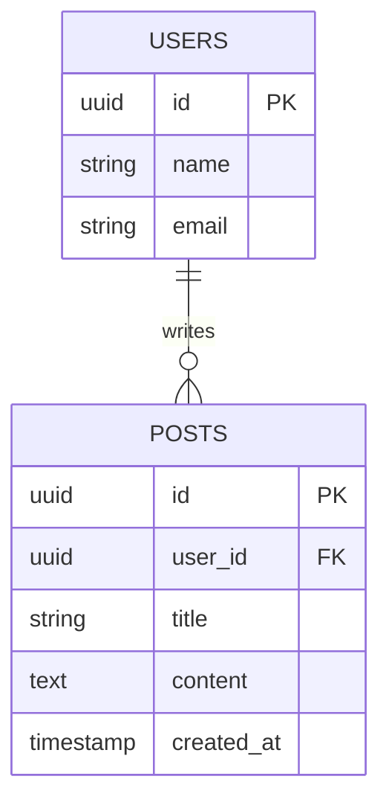

### Understanding the Data Model of Apache Cassandra

#### Basic Concepts

1. **Keyspace**: This is the top-level container in Cassandra and is analogous to a database in the world of relational databases. It defines data replication and strategy options.

2. **Column**: A basic data structure consisting of a column name, a value, and a timestamp.

3. **Column Family (Table)**: A collection of rows, where each row is identified by a unique key. It's similar to a table in RDBMS, but each row can have a different set of columns.

4. **Row**: A set of columns identified by a primary key. Each row in a column family is not required to have the same columns.

5. **Primary Key**: Uniquely identifies a row in a column family. It can be simple (single column) or composite (multiple columns).

6. **Partition Key**: The first part of the primary key. It determines the distribution of data across nodes.

7. **Clustering Columns**: The other part of a composite primary key. They determine the order of data within a partition.

8. **CQL (Cassandra Query Language)**: A SQL-like language used for interacting with Cassandra.

#### Example

Let's say you have a social media application and you want to store user posts. Here's how you might design a column family (table) for this:

**Keyspace**: SocialMedia

**Column Family (Table)**: UserPosts

**Columns**:
- UserId (Partition Key)
- PostId (Clustering Column)
- PostText
- PostTime
- LikesCount
- CommentsCount

In this example, `UserId` and `PostId` together form the primary key. `UserId` is the partition key which means all posts by the same user are stored together on the same node. `PostId` is the clustering column, which might be used to order the posts by time or some other criterion.

#### CQL Example

Creating a keyspace:

```sql
CREATE KEYSPACE SocialMedia WITH replication = {'class': 'SimpleStrategy', 'replication_factor' : 3};
```

Creating a table:

```sql
CREATE TABLE SocialMedia.UserPosts (
    UserId uuid,
    PostId uuid,
    PostText text,
    PostTime timestamp,
    LikesCount int,
    CommentsCount int,
    PRIMARY KEY (UserId, PostId)
);
```

Inserting data:

```sql
INSERT INTO SocialMedia.UserPosts (UserId, PostId, PostText, PostTime, LikesCount, CommentsCount) 
VALUES (123e4567-e89b-12d3-a456-426655440000, 987f6543-e21b-76e3-c456-526655441234, 'Hello Cassandra!', '2020-10-01 10:20:30', 100, 10);
```

Querying data:

```sql
SELECT * FROM SocialMedia.UserPosts WHERE UserId = 123e4567-e89b-12d3-a456-426655440000;
```

This is a basic example. In practice, your data model in Cassandra will depend on your specific query requirements and data access patterns. It's important to model your data in Cassandra based on how you plan to access it, rather than trying to impose a relational model onto it. Cassandra is designed for high performance, distributed data handling, and it achieves this through its unique data model.
--------------
##Run following command  in a separate terminal to forward your request to your cassandra service.

```bash
kubectl port-forward svc/cassandra 9042  &
```

-----------------
### WHERE Clause

The `WHERE` clause in Apache Cassandra's CQL (Cassandra Query Language) is used to filter results based on specified conditions. Understanding how to effectively use the `WHERE` clause in Cassandra is crucial due to its limitations and differences from traditional SQL databases.

### Key Points in Using `WHERE` Clause in Cassandra

1. **Partition Key Filtering**: You must specify an equality condition on the entire partition key for filtering. This is because Cassandra distributes data across the cluster based on the partition key.

2. **Clustering Columns**: After filtering on the partition key, you can optionally filter on clustering columns. You can use equality, range operators, and the `IN` keyword on clustering columns.

3. **Allow Filtering**: If you need to filter on non-key columns, you must use the `ALLOW FILTERING` directive. However, it's generally not recommended for large-scale queries as it can be inefficient and put a heavy load on the cluster.

4. **Order of Conditions**: The order of conditions in the `WHERE` clause should follow the order of primary key columns (first partition key, then clustering columns).

### Example Scenario

Let's continue with the `SocialMedia.UserPosts` table from the previous example:

- **Keyspace**: SocialMedia
- **Column Family (Table)**: UserPosts
- **Columns**:
    - UserId (Partition Key)
    - PostId (Clustering Column)
    - PostText
    - PostTime
    - LikesCount
    - CommentsCount

### Example Queries

1. **Basic Query**:

   To retrieve all posts by a specific user:
   ```sql
   SELECT * FROM SocialMedia.UserPosts WHERE UserId = 123e4567-e89b-12d3-a456-426655440000;
   ```

2. **Range Query on Clustering Column**:

   To retrieve posts by a user within a certain time range:
   ```sql
   SELECT * FROM SocialMedia.UserPosts 
   WHERE UserId = 123e4567-e89b-12d3-a456-426655440000 
   AND PostTime >= '2020-01-01 00:00:00' AND PostTime <= '2020-12-31 23:59:59';
   ```

   Note: This assumes `PostTime` is a clustering column. If not, you'll need `ALLOW FILTERING`.

3. **Using `ALLOW FILTERING`**:

   If you want to filter based on a non-key column, like fetching posts with more than 100 likes:
   ```sql
   SELECT * FROM SocialMedia.UserPosts 
   WHERE LikesCount > 100 
   ALLOW FILTERING;
   ```

   Caution: Use `ALLOW FILTERING` sparingly, as it can cause performance issues.

### Best Practices

- Always try to query by the partition key.
- Use `ALLOW FILTERING` only for infrequent or small-scale queries.
- Design your data model based on your query patterns to make the best use of Cassandra's strengths.

Remember, the way Cassandra handles data distribution and retrieval is quite different from relational databases, so designing your queries and data model in a way that aligns with Cassandra's architecture is key to achieving good performance.

-----------------

### Bulk Data
Loading bulk data into Apache Cassandra efficiently is a common requirement, especially when dealing with large datasets. There are several methods to accomplish this, but the most common and efficient ones are using the `COPY` command in CQLSH (Cassandra Query Language Shell) and using the Cassandra Bulk Loader (Cassandra Loader).

### 1. Using the `COPY` Command in CQLSH

The `COPY` command is a simple and effective way to import or export data in Cassandra. It's suitable for moderate amounts of data.

#### Example

Suppose you have a CSV file `user_posts.csv` with data corresponding to the `UserPosts` table in your `SocialMedia` keyspace. The CSV format might look like this:

```
UserId,PostId,PostText,PostTime,LikesCount,CommentsCount
123e4567-e89b-12d3-a456-426655440000,111a2222-333b-44c4-d5e5-666f77788899,"My first post",2023-01-01 10:00:00,10,2
...

```

To import this data into Cassandra, you would use:

```shell
COPY SocialMedia.UserPosts (UserId, PostId, PostText, PostTime, LikesCount, CommentsCount) 
FROM 'path_to_your_file/user_posts.csv' 
WITH HEADER = TRUE;
```

### 2. Using the Cassandra Bulk Loader (Cassandra Loader)

For very large datasets, Cassandra provides a more efficient tool called Cassandra Loader. It's designed to handle large-scale data loads and is more performant than the `COPY` command for such scenarios.

#### Steps

1. **Prepare Your Data**: Your data should be in a format that the Cassandra Loader can understand, typically a CSV file.

2. **Install Cassandra Loader**: Download and set up Cassandra Loader on your machine where you have access to your Cassandra cluster.

3. **Load the Data**: Use Cassandra Loader to import your data. The command varies based on your setup and the specifics of your data.

#### Example Command

```shell
cassandra-loader -f /path_to_your_file/user_posts.csv -host localhost -schema "SocialMedia.UserPosts(UserId, PostId, PostText, PostTime, LikesCount, CommentsCount)"
```

### Best Practices

1. **Data Format**: Ensure your CSV or data file matches the format of your Cassandra table schema.
2. **Batch Size**: For the `COPY` command, you might need to adjust the batch size depending on your dataset size.
3. **Performance Tuning**: For Cassandra Loader, tuning parameters like number of threads, batch size, and rate limiting can significantly affect performance.
4. **Network Considerations**: If you are loading data into a remote cluster, network bandwidth and latency can impact performance.
5. **Error Handling**: Monitor for any errors during the load process and have a strategy for handling failed or partial imports.

### Note
- The `COPY` command is part of CQLSH and is good for moderate-sized datasets or for instances where you need a quick and easy solution.
- For very large datasets, Cassandra Loader is more efficient and faster but requires additional setup and configuration.

Always test your bulk load process with a small subset of data first to ensure everything works as expected before attempting a full-scale data import.

-----------------
### JSON Data Handling

JSON (JavaScript Object Notation) format is widely used for data interchange, and Cassandra, a distributed NoSQL database, supports JSON for importing and exporting data. Here's a basic tutorial on how to work with JSON format in Cassandra:

### Prerequisites

- Ensure Cassandra is installed and running on your system.
- Basic familiarity with CQL (Cassandra Query Language).

### Creating a Keyspace and Table

1. **Create a Keyspace**: This is like a database in traditional RDBMS.
   ```sql
   CREATE KEYSPACE mykeyspace WITH replication = {'class': 'SimpleStrategy', 'replication_factor': 1};
   ```

2. **Create a Table**: Define a table within the keyspace.
   ```sql
   USE mykeyspace;
   CREATE TABLE users (
       id UUID PRIMARY KEY,
       name text,
       email text
   );
   ```

### Exporting Data to JSON

To export data from a Cassandra table to a JSON file:

1. **Use `COPY TO` Command**:
   ```sql
   COPY mykeyspace.users TO 'users.json' WITH JSON = true;
   ```

   This command will export data from the `users` table into a file named `users.json` in JSON format.

### Importing Data from JSON

To import data into a Cassandra table from a JSON file:

1. **Prepare JSON File**: Ensure your JSON file is in the correct format. Example (`users.json`):
   ```json
   [
       {"id": "550e8400-e29b-41d4-a716-446655440000", "name": "John Doe", "email": "john.doe@example.com"},
       {"id": "550e8400-e29b-41d4-a716-446655440001", "name": "Jane Doe", "email": "jane.doe@example.com"}
   ]
   ```

2. **Use `COPY FROM` Command**:
   ```sql
   COPY mykeyspace.users FROM 'users.json' WITH JSON = true;
   ```

   This command will import data from `users.json` into the `users` table in Cassandra.

### Points to Remember

- The JSON file should contain an array of objects, where each object represents a row in the table.
- Field names in the JSON file should match the column names of the table.
- Data types should be compatible with the Cassandra schema.

### Troubleshooting

- If you encounter issues, check for data type mismatches and ensure the JSON file is properly formatted.
- Ensure Cassandra's permissions and configurations allow file reading and writing.


-----------
### Primary Index

Using a primary index effectively in Cassandra is crucial for optimal data retrieval. Cassandra uses primary keys to distribute data across nodes and to retrieve data quickly. Here's a tutorial on how to use primary indexes in Cassandra, including an example:

### Understanding Primary Keys in Cassandra

In Cassandra, the primary key is divided into two parts:

1. **Partition Key**: Determines the distribution of data across various nodes in the cluster.
2. **Clustering Columns** (optional): Determines the order of data within the partition.

### Creating a Keyspace and Table

1. **Start Cassandra**: Ensure that Cassandra is running on your system.

2. **Create a Keyspace**: Similar to a database in RDBMS.
   ```sql
   CREATE KEYSPACE mykeyspace WITH replication = {'class': 'SimpleStrategy', 'replication_factor': 1};
   ```

3. **Create a Table with a Primary Key**:
   - **Simple Primary Key**: If you have only one column as a primary key.
   - **Composite Primary Key**: If you have a combination of partition and clustering columns.

Example of a table with a composite primary key:

```sql
USE mykeyspace;

CREATE TABLE orders (
    order_id UUID,
    order_date date,
    customer_id UUID,
    amount decimal,
    PRIMARY KEY ((order_id), order_date)
);
```

In this example:
- `order_id` is the partition key.
- `order_date` is a clustering column.

### Inserting Data

```sql
INSERT INTO mykeyspace.orders (order_id, order_date, customer_id, amount)
VALUES (uuid(), '2023-01-01', uuid(), 100.00);
```

### Querying Data

1. **Simple Query**: Retrieve based on the partition key.
   ```sql
   SELECT * FROM mykeyspace.orders WHERE order_id = some_uuid;
   ```

2. **Query with Clustering Column**: More specific.
   ```sql
   SELECT * FROM mykeyspace.orders WHERE order_id = some_uuid AND order_date = '2023-01-01';
   ```

### Points to Remember

- Queries in Cassandra should be made primarily against the partition key for efficiency.
- Omitting the partition key in queries can result in full table scans, which are highly inefficient and not recommended in Cassandra.
- The order of columns in the `PRIMARY KEY` definition is significant. The first part is always the partition key, and the rest are clustering columns.
- The partition key is responsible for data distribution across the cluster.

### Best Practices

- Design your table schema based on your query patterns.
- Avoid large partitions by wisely choosing partition keys.
- Remember that each unique partition key represents a row of data in Cassandra.

-----------------

### Secondary Index

Creating a secondary index in Cassandra can enhance the flexibility of your queries, allowing you to query non-primary key columns. However, it's important to use secondary indexes judiciously, as they can impact performance. Here's a step-by-step guide with an example:

### Understanding Secondary Indexes in Cassandra

- **Purpose**: Allows queries on columns that are not part of the primary key.
- **Use Case**: Suitable for columns with low cardinality (few unique values).
- **Performance Consideration**: Can lead to inefficient queries if not used carefully.

### Prerequisites

- Cassandra is installed and running.
- Basic understanding of CQL (Cassandra Query Language).

### Step 1: Creating a Keyspace and Table

1. **Create a Keyspace**: Similar to creating a database in RDBMS.
   ```sql
   CREATE KEYSPACE mykeyspace WITH replication = {'class': 'SimpleStrategy', 'replication_factor': 1};
   ```

2. **Create a Table**:
   ```sql
   USE mykeyspace;

   CREATE TABLE employees (
       id UUID PRIMARY KEY,
       name text,
       department text,
       salary decimal
   );
   ```

### Step 2: Creating a Secondary Index

Suppose you frequently need to query employees based on their department. Since `department` is not a primary key, you'll create a secondary index on this column.

```sql
CREATE INDEX ON mykeyspace.employees (department);
```

### Step 3: Using the Secondary Index in Queries

Now, you can efficiently query the `employees` table by the `department`:

```sql
SELECT * FROM mykeyspace.employees WHERE department = 'Engineering';
```

### Points to Remember

- Secondary indexes in Cassandra are local to each node. Each node maintains an index for the data it stores, which can lead to performance issues for large datasets.
- They are best used for columns with low cardinality. High cardinality columns (like `email`, `name`, etc.) can lead to inefficient queries.
- Avoid creating secondary indexes on frequently updated or deleted columns.

### Best Practices

- Analyze your query patterns before deciding to use secondary indexes.
- Consider using materialized views or denormalizing data as alternatives to secondary indexes for better performance.
- Monitor the performance impact of secondary indexes in your environment.

-----------------
### Composite Partition Key

Defining a composite partition key in Cassandra is an important aspect of data modeling, particularly when dealing with large datasets that need to be distributed evenly across the cluster. A composite partition key helps in distributing the data more evenly and allows for more efficient querying. Here’s a step-by-step guide with an example:

### Understanding Composite Partition Keys

- **Composite Partition Key**: Consists of multiple columns combined to form a single partition key.
- **Purpose**: To distribute data more evenly across the cluster and reduce the risk of hotspots.
- **Usage**: Useful when no single column can uniquely and evenly distribute the data.

### Prerequisites

- Ensure Cassandra is installed and running on your system.
- Basic familiarity with CQL (Cassandra Query Language).

### Step 1: Creating a Keyspace

1. **Create a Keyspace** (if not already created):
   ```sql
   CREATE KEYSPACE mykeyspace WITH replication = {'class': 'SimpleStrategy', 'replication_factor' : 1};
   ```

### Step 2: Creating a Table with a Composite Partition Key

1. **Define the Table**: Here, we'll create a table where the composite partition key will consist of two columns.

Example: Creating a `customer_orders` table to record customer orders, where the partition key is a combination of `customer_id` and `country`.

```sql
USE mykeyspace;

CREATE TABLE customer_orders (
    customer_id UUID,
    country text,
    order_id UUID,
    order_date date,
    amount decimal,
    PRIMARY KEY ((customer_id, country), order_id)
);
```

In this structure:
- `customer_id` and `country` together form the composite partition key.
- `order_id` is a clustering column, which will order the data within the partition.

### Step 3: Inserting Data

When inserting data, you need to provide values for both components of the composite partition key.

```sql
INSERT INTO mykeyspace.customer_orders (customer_id, country, order_id, order_date, amount)
VALUES (uuid(), 'USA', uuid(), '2023-01-01', 100.00);
```

### Step 4: Querying Data

Querying the table effectively requires specifying the complete composite partition key.

```sql
SELECT * FROM mykeyspace.customer_orders WHERE customer_id = some_uuid AND country = 'USA';
```

### Points to Remember

- The partition key determines how data is distributed across the cluster. A well-designed partition key can prevent data hotspots.
- Composite partition keys are useful when a single column does not provide a good distribution of data.
- Remember that each unique combination of the partition key columns forms a different partition.

### Best Practices

- Choose partition key columns that evenly distribute data across the cluster.
- Be mindful of the size of the partitions; very large partitions can lead to performance issues.
- Design your data model based on your application's query patterns.


-----------

### Example: Data Model for a Blogging Platform

Let's consider a basic data model for a blogging platform with two tables: `users` and `posts`. The `users` table contains user information, and the `posts` table contains blog posts made by users.



In this diagram:

- `USERS` and `POSTS` are two tables.
- `USERS` has `id` as the primary key.
- `POSTS` has `id` as the primary key and `user_id` as a foreign key referencing `USERS`.
- A one-to-many relationship is depicted from `USERS` to `POSTS`, indicating that one user can write many posts.

### How to Read the Diagram

- **Entities (Tables)**: Represented as boxes (e.g., `USERS`, `POSTS`).
- **Attributes (Columns)**: Listed inside the entity boxes.
- **Primary Key (PK)**: Denoted next to the respective column (e.g., `id PK`).
- **Foreign Key (FK)**: Denoted next to the respective column that references a primary key in another table (e.g., `user_id FK`).
- **Relationships**: The line connecting `USERS` and `POSTS` shows the relationship, with the notation `||--o{` indicating a one-to-many relationship.

### Note

- This diagram is a simplified representation and may not include all aspects of Cassandra data modeling, such as clustering columns and secondary indexes.
- In Cassandra, foreign key concepts do not exist as in relational databases, but for the sake of understanding relationships in the data model, it's depicted here.

