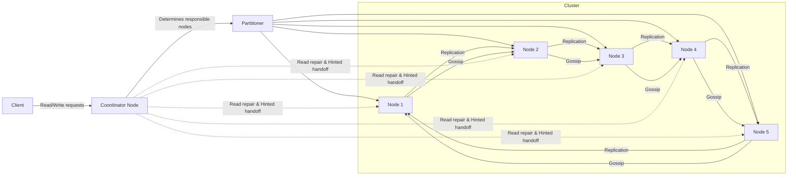

Below is a  diagram that represents the key components of a Cassandra cluster and their relationships:

### Understanding the Diagram

- **Client**: Initiates read/write requests.
- **Coordinator Node**: The node that receives the client's request and coordinates the operation within the cluster.
- **Partitioner**: Determines which nodes are responsible for storing a particular key based on the partitioning strategy (e.g., Murmur3Partitioner).
- **Cluster**: Consists of multiple nodes (Node 1, Node 2, etc.) that store and manage data.
- **Nodes**: Represent individual instances in the Cassandra cluster. Each node communicates with other nodes.
- **Replication**: Indicates how data is replicated across different nodes for redundancy.
- **Gossip Protocol**: Used for inter-node communication to share information about the state of the cluster.
- **Read Repair & Hinted Handoff**: Mechanisms used by the coordinator to ensure data consistency across nodes. (Dashed lines indicate these background processes.)

