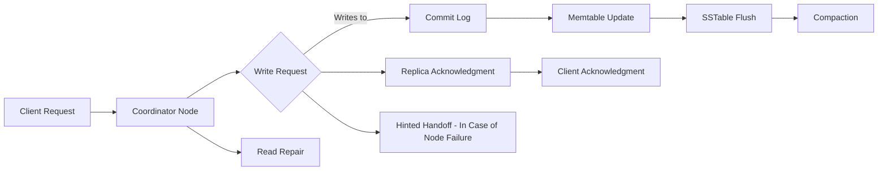

Updating data in Apache Cassandra, a distributed NoSQL database system, involves several steps and considerations. Here's a basic tutorial:

### Understanding Cassandra's Data Model
Before updating data, it's essential to understand Cassandra's data model, which is different from traditional relational databases. Cassandra organizes data into tables within a keyspace (similar to a schema in SQL databases).

### Primary Key
Each table has a primary key, which is crucial for data updates. The primary key consists of partition keys and clustering columns. The partition key determines the data distribution across nodes, while clustering columns define the data order within a partition.

### The `UPDATE` Statement
To update data in Cassandra, use the `UPDATE` statement. The syntax is similar to SQL:

```cql
UPDATE keyspace_name.table_name
SET column1 = value1, column2 = value2, ...
WHERE primary_key_column = key_value
  AND clustering_column = clustering_value;
```

### Update Example
Suppose you have a table named `users` in the `user_data` keyspace, with a primary key composed of `user_id` (partition key) and `email` (clustering column). To update a user's name:

```cql
UPDATE user_data.users
SET name = 'John Doe'
WHERE user_id = 123 AND email = 'john@example.com';
```

### Considerations for Updating Data
1. **Primary Key**: You must specify the entire primary key in the `WHERE` clause.
2. **Performance**: Updates in Cassandra are upserts. If the specified primary key does not exist, Cassandra creates a new row.
3. **Batch Updates**: Cassandra allows batch updates, but use them judiciously as they can affect performance.
4. **Timestamps**: Cassandra uses timestamps to resolve conflicts. Each update has a timestamp, and the most recent update (based on the timestamp) wins.

### Lightweight Transactions
Cassandra supports lightweight transactions (LWT) for conditional updates. These are more costly in terms of performance but ensure atomicity and isolation.

```cql
UPDATE user_data.users
SET name = 'Jane Doe'
WHERE user_id = 123 AND email = 'jane@example.com'
IF exists;
```

### Updating Collections
Cassandra supports collection data types like lists, sets, and maps. Updating these collections has specific syntaxes, for example, adding an item to a list:

```cql
UPDATE user_data.users
SET interests = interests + ['reading']
WHERE user_id = 123;
```

---------------


Updating data in Cassandra involves a specific lifecycle that can be illustrated using a diagram. 

### Lifecycle of Data Update in Cassandra

1. **Client Request**: The process begins with a client sending an update request to one of the Cassandra nodes (coordinator node).

2. **Write Path**:
   - **Coordinator Node**: The coordinator node receives the update request.
   - **Write Request**: The coordinator node forwards the write request to the replicas that are responsible for the data based on the partition key.
   - **Consistency Level**: The number of replicas that must acknowledge the write operation before it's considered successful depends on the configured consistency level.

3. **Commit Log**:
   - **Write to Commit Log**: Each replica node writes the update to its commit log (a crash-recovery mechanism) to ensure durability.
   - **Memtable Update**: After writing to the commit log, the data is updated in the memtable (an in-memory data structure).

4. **SSTable Flush**:
   - **Flushing to SSTable**: Periodically, data from the memtable is flushed to disk in a structure called an SSTable (Sorted String Table).
   - **Compaction**: Over time, SSTables are compacted to optimize read performance and save disk space.

5. **Acknowledgment**:
   - **Replica Acknowledgment**: Replica nodes send an acknowledgment back to the coordinator node after the update is written to the commit log and memtable.
   - **Client Acknowledgment**: Once the required number of acknowledgments (based on the consistency level) are received, the coordinator node sends a success response to the client.

6. **Read Repair** (Optional):
   - If a subsequent read request detects discrepancies in replicas (due to eventual consistency), Cassandra can perform a read repair to update all replicas with the most recent data.

7. **Hinted Handoff** (In Case of Node Failure):
   - If a replica node is down during the update, the coordinator node temporarily stores the update in a hinted handoff. Once the node is back online, the hint is sent to that node to ensure data consistency.

### Conceptual Diagram Representation



------------------------------


Deleting data in Apache Cassandra and handling the freed space afterward involves several steps and considerations. Here's a tutorial to guide you through this process:

### 1. Understanding Cassandra's Delete Operations
Cassandra uses a mechanism called a "tombstone" to mark data for deletion. When you delete a record, Cassandra doesn't immediately remove the data from disk. Instead, it marks the record with a tombstone. The actual deletion occurs later during a process called compaction.

### 2. Using the `DELETE` Statement
To delete data in Cassandra, you use the `DELETE` statement. Here's the basic syntax:

```cql
DELETE FROM keyspace_name.table_name WHERE primary_key_column = key_value;
```

For example, to delete a user from the `users` table:

```cql
DELETE FROM user_data.users WHERE user_id = 123;
```

### 3. Deleting Specific Columns
You can also delete specific columns rather than the entire row:

```cql
DELETE column_name FROM keyspace_name.table_name WHERE primary_key_column = key_value;
```

### 4. Deleting with Timestamps
Cassandra allows specifying a timestamp for the deletion. This is useful for resolving conflicts in distributed environments:

```cql
DELETE FROM keyspace_name.table_name USING TIMESTAMP 123456789 WHERE primary_key_column = key_value;
```

### 5. Handling Freed Space After Deletion
After large deletions, Cassandra handles the freed space through a process called compaction.

#### Compaction Process
- **What Is Compaction?**: Compaction is the process of merging SSTables (Sorted String Tables) and discarding unnecessary data (like data marked with a tombstone).
- **Triggering Compaction**: Compaction can be triggered automatically by Cassandra or manually by an administrator.
- **Types of Compaction**: Cassandra offers several compaction strategies, such as SizeTieredCompactionStrategy, LeveledCompactionStrategy, and TimeWindowCompactionStrategy, each suited for different use cases.

#### Handling Freed Space
- **During Compaction**: When compaction runs, it reads SSTables, merges and rewrites them, excluding data marked with tombstones that have surpassed a certain age (defined by `gc_grace_seconds`).
- **Reclaiming Space**: Once the old SSTables are replaced by the new compacted SSTables, Cassandra deletes the old SSTables, thus reclaiming disk space.
- **`gc_grace_seconds`**: This setting defines how long Cassandra must keep tombstones. It’s crucial for ensuring that deleted data is removed from all replicas.

### 6. Considerations and Best Practices
- **Impact on Performance**: Large deletions and subsequent compactions can be resource-intensive and affect Cassandra's performance.
- **Tuning Compaction**: Choose and tune the compaction strategy based on your use case for efficient space management and performance.
- **Regular Monitoring**: Monitor disk space and compaction performance, especially after large deletions.


------------------


Understanding the role of tombstones in Apache Cassandra is crucial for effectively managing your Cassandra database. 

### 1. Introduction to Tombstones

- **What Are Tombstones?**
  - Tombstones are markers that indicate a deletion in Cassandra. When you delete data (either a whole row or a specific column), Cassandra doesn't immediately remove the data from the disk; instead, it marks the deleted data with a tombstone.

- **Why Tombstones?**
  - Due to Cassandra's distributed nature and eventual consistency model, immediate data deletion is impractical. Tombstones help manage the deletion process across multiple nodes and ensure data consistency.

### 2. Creating Tombstones

- **Using `DELETE` Statements**
  - Tombstones are created when you execute `DELETE` statements. For example, `DELETE FROM mykeyspace.mytable WHERE mykey = 'key1';` creates a tombstone for the specified row.

- **TTL (Time-To-Live)**
  - Data can also be marked with a TTL (Time-To-Live). When TTL expires, Cassandra automatically generates a tombstone for the expired data.

### 3. Lifecycle of a Tombstone

- **Marking Data as Deleted**
  - Initially, tombstones mark data as deleted. This data is still present on the disk but is considered logically deleted.

- **Replication and Consistency**
  - Tombstones are replicated across nodes to ensure all replicas mark the deletion. This process maintains consistency across the cluster.

- **Garbage Collection**
  - After a certain period (defined by `gc_grace_seconds`), tombstones are eligible for removal during compaction. This period allows all nodes in the cluster to learn about the deletion.

### 4. Compaction and Tombstone Removal

- **Compaction Process**
  - Compaction is the process where Cassandra merges SSTables (Sorted String Tables) and discards obsolete data (including data marked with tombstones).

- **Purging Tombstones**
  - During compaction, if a tombstone has existed longer than `gc_grace_seconds`, it and the data it marks are removed from the SSTables, reclaiming disk space.

### 5. Impact of Tombstones

- **Performance Considerations**
  - Excessive tombstones can lead to performance issues, as Cassandra must read and process them during read queries.

- **`gc_grace_seconds` Tuning**
  - This parameter determines how long tombstones live before being purged. Tuning it can help manage tombstone accumulation but requires careful consideration of replication and repair schedules.

### 6. Best Practices and Monitoring

- **Regular Repair**
  - Regular repair operations ensure all replicas are up-to-date, which is important for effective tombstone management.

- **Monitoring Tombstone Counts**
  - Monitor the number of tombstones in your database. High counts can indicate issues with data model design or deletion practices.

- **Data Modeling Considerations**
  - Design your data model to minimize deletions and avoid models that lead to the frequent generation of tombstones.

### Note

Tombstones play a critical role in Cassandra's deletion process, ensuring data consistency across a distributed environment. Understanding their lifecycle, impact on performance, and best practices for management is key to maintaining a healthy Cassandra database. Regular monitoring and appropriate data modeling can help mitigate the potential negative effects of tombstones.

------------------------

Using Time-To-Live (TTL) in Apache Cassandra is an effective way to manage the lifecycle of your data automatically. TTL allows you to specify a period after which the data expires and is eligible for deletion. 

### Understanding TTL (Time-To-Live)

- **Definition**: TTL is a feature in Cassandra that sets a time limit (in seconds) on how long a piece of data is valid.
- **Automatic Deletion**: When the specified TTL duration elapses, Cassandra marks the data with a tombstone, which later gets removed during the compaction process.
- **Use Cases**: TTL is useful for transient data like session information, cache data, or any data that loses relevance after a certain period.

### Setting TTL on Data

#### Syntax for Setting TTL

- **On a Per-Column Basis**:
  ```cql
  INSERT INTO table_name (column1, column2, ...)
  VALUES (value1, value2, ...)
  USING TTL time_in_seconds;
  ```
- **On a Whole Row**:
  ```cql
  INSERT INTO table_name (column1, column2, ...)
  VALUES (value1, value2, ...)
  USING TTL time_in_seconds;
  ```
- **Updating Existing Data with TTL**:
  ```cql
  UPDATE table_name
  USING TTL time_in_seconds
  SET column1 = value1
  WHERE primary_key_column = key_value;
  ```

#### Example

- **Setting a TTL of 24 Hours**:
  ```cql
  INSERT INTO user_sessions (session_id, user_id, session_data)
  VALUES (12345, 67890, 'session info')
  USING TTL 86400;
  ```

### Checking TTL on Data

- **Using the `TTL` Function**:
  To check the remaining TTL on specific data, use the `TTL` function in a `SELECT` statement:
  ```cql
  SELECT TTL(column_name) FROM table_name WHERE primary_key_column = key_value;
  ```

### Implications and Considerations

- **No Default TTL**:
  - Data without a specified TTL will remain in the database indefinitely.
- **Impact on Performance**:
  - While TTL is a convenient feature, it can lead to the creation of tombstones, which, if not managed properly, can impact performance during reads.
- **Granularity**:
  - TTL values are set in seconds and apply uniformly to the specified column(s) or row.
- **Non-Updateable**:
  - Once set, you cannot modify or remove the TTL of a specific value directly. However, you can overwrite the data with a new TTL.

### Best Practices

- **Use for Appropriate Data Types**:
  - Employ TTL for data that inherently has a limited lifespan, like sessions, logs, or temporary cache data.
- **Monitor Tombstone Creation**:
  - Since TTLs result in tombstones, it's crucial to monitor their impact and adjust your compaction strategies accordingly.
- **Data Modeling**:
  - Consider TTL in your data modeling. Design your schema in a way that optimizes the use of TTL and minimizes the impact of tombstones.

### Note

TTL is a powerful feature in Cassandra that helps in automatically managing the lifecycle of data. By setting TTLs, you can ensure that data doesn't overstay its relevance, which is particularly useful for transient or time-sensitive data. However, it's essential to use TTL judiciously and be aware of its implications on tombstone creation and overall database performance. Regular monitoring and thoughtful data modeling are key to leveraging TTL effectively in Cassandra.
